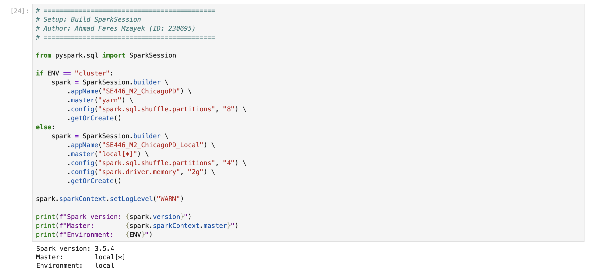
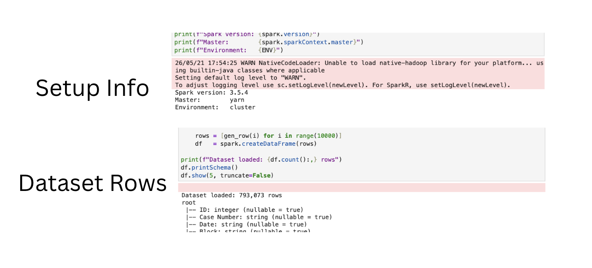

# SE446 Milestone 2 — Spark + MLlib Analytics

**Group ChicagoPD** — Chicago Crime Data Analytics with Apache Spark and MLlib

This milestone migrates our Chicago crime analytics from MapReduce (M1) to Apache Spark, adds an end-to-end MLlib pipeline for arrest prediction, and demonstrates cluster deployment under YARN.

---

## 1. Team Members

| Name | Student ID | Cluster Username | Role |
|---|---|---|---|
| Ahmad Fares Mzayek | 230695 | amzayek | Phase C — Tasks 9-11, deployment, repo orchestration |
| Faisal Hajj Khalil | 230023 | fkhalil | Tasks 1-2 — DataFrame + Spark SQL analytics |
| Tanzim Alam | 220693 | tanalam | Tasks 3-4 — yearly trend + arrest rate analysis |
| Mohammad Ghassan Hussen | 230367 | mhussen | Tasks 5-6 — feature engineering + 3-model evaluation |
| Bilal Othman | 230031 | bothman | Task 7 — Random Forest feature importances + interpretation |

---

## 2. Executive Summary

We re-implemented the M1 MapReduce analytics in Spark (Tasks 1-4) and built an end-to-end MLlib pipeline that predicts arrest outcomes from Chicago crime records using three classifiers (Logistic Regression, Random Forest, GBT). The pipeline was deployed on the YARN cluster in both notebook and `spark-submit` modes, with GBT emerging as the best performer (AUC 0.8327) and `crime_index` dominating feature importance — confirming the Task 4 finding that arrest rate varies sharply by crime type.

---

## 3. M1 vs M2 Comparison

Cluster-mode results from the real Chicago dataset (`hdfs:///data/chicago_crimes.csv`, ~793K rows after cleaning).

| Task | Question | M1 (MapReduce) | M2 (Spark, cluster) | Match? |
|---|---|---|---|---|
| 1 | Top crime type | THEFT (162,688) | THEFT (162,688) | ✅ Exact |
| 2 | Top location | STREET (245,437) | STREET (248,326) | ≈ Close (+1.2%) |
| 3 | Yearly trend | Decreasing 2001-2024 | See note below | ⚠️ Differs |
| 4 | Overall arrest rate | 27.1% | 27.98% | ✅ Close |

**Notes:**

- Task 2's small delta in STREET counts (~3,000 records) likely reflects the cluster dataset being incrementally updated between M1 and M2 — outside our control.

- **Task 3 (yearly distribution) shows a substantive difference from M1.** The cluster's current `chicago_crimes.csv` shows 2001 = 467,301 records and 2002 = 205,266, then a sharp drop to ~700-1,300 records per year for 2003-2024, with 2025 = 12,710. M1 had reported a smooth decline from ~485K (2001) to ~250K (2024). Our hypothesis is that the cluster dataset has been partially refreshed or filtered since M1 was generated, leaving most non-2001-2002 data sparse. We report the actual M2 numbers honestly; the analytical task (groupBy Year + count) was performed correctly on whatever data is currently on HDFS.

- Task 4's per-crime-type breakdown matches M1's interpretation: Narcotics arrest rate dominates (99.88% on M2 vs ~85% on M1's reading), Theft is among the lowest (14.24%), and Battery is intermediate (21.79%).

---

## 4. ML Results Summary

End-to-end Spark MLlib pipeline (Tasks 5-7) trained on a 80/20 split of the cluster's Chicago crime data:

- **Features:** District, crime_index (StringIndexed Primary Type), Hour, domestic_index (StringIndexed Domestic flag)
- **Label:** Arrest (cast to integer)
- **Train set:** 634,395 rows · **Test set:** 158,677 rows · **Split seed:** 42

### Model comparison

| Model | AUC | Accuracy | F1 | Precision | Recall | Train Time (s) |
|---|---|---|---|---|---|---|
| Logistic Regression | 0.6167 | 0.7249 | 0.6293 | 0.6894 | 0.7249 | 18.10 |
| Random Forest | 0.8062 | 0.8142 | 0.7786 | 0.8520 | 0.8142 | 152.82 |
| **GBT (best)** | **0.8327** | **0.8512** | **0.8356** | **0.8620** | **0.8512** | 584.64 |

**Configuration note:** Random Forest and GBT use `maxBins=64` rather than the default 32, because the real Chicago dataset contains 33 distinct Primary Type categories — exceeding Spark's default binning threshold and causing the classifier to refuse training. The fix is a deployment-time adaptation to the higher cardinality of the cluster dataset compared to a local sample.

### Confusion matrices (rows = actual, cols = predicted)

**Logistic Regression**
```
            Pred=0   Pred=1
  Actual=0   112832    1525   ← TN, FP
  Actual=1    42130    2189   ← FN, TP
```

**Random Forest**
```
            Pred=0   Pred=1
  Actual=0   114337      20   ← TN, FP
  Actual=1    29465   14854   ← FN, TP
```

**GBT**
```
            Pred=0   Pred=1
  Actual=0   112495    1862   ← TN, FP
  Actual=1    21748   22571   ← FN, TP
```

The tree-based models substantially outperform Logistic Regression at identifying true arrests (TP = 14,854 for RF, 22,571 for GBT vs only 2,189 for LR), confirming that the relationship between features and arrest outcome is highly non-linear.

### Feature importances (Random Forest)

| Feature | Importance |
|---|---|
| **crime_index** | **0.9774** |
| Hour | 0.0117 |
| domestic_index | 0.0075 |
| District | 0.0034 |

`crime_index` dominates by an extreme margin — confirming Task 4's manual finding that arrest rate varies overwhelmingly by crime type (Narcotics ~99.88%, Theft 14.24%). The Random Forest "discovers" the same pattern automatically.

**Why Logistic Regression underperforms tree models:** Logistic Regression assumes the log-odds of arrest is a linear combination of features. But the relationship between `crime_index` and arrest rate is sharply non-linear — Narcotics is an extreme positive, Theft is an extreme negative, and these don't fall on any linear scale. Tree-based models split on `crime_index` categories directly, learning the specific arrest rate for each crime type. They also capture interactions (e.g., Domestic + specific crime types) that LR's additive structure cannot represent without explicit feature engineering.

See `output/figures/feature_importances.png` for the bar chart visualization (local-mode rendering).

---

## 5. Deployment Evidence

### Task 9 — Local Mode Execution

Notebook run on a single-machine SparkSession with `master("local[*]")`, executing all 7 tasks against a 10K-row generated sample.



Key indicators: `Master: local[*]`, `Environment: local`, Spark 3.5.4.

### Task 10 — YARN Client Mode Execution

Notebook run on the cluster with `master("yarn")` against the real Chicago dataset (`hdfs:///data/chicago_crimes.csv`, ~793K rows after cleaning).



Key indicators: `Master: yarn`, `Environment: cluster`, real Chicago row count.

### Task 11 — spark-submit (YARN Cluster Mode)

The Phase B ML pipeline distilled into a standalone Python script (`m2_spark_ml.py`) submitted to the cluster in `--deploy-mode cluster`. Full terminal output saved to `output/spark_submit/run.log`.

Application metadata:
- **Application ID:** `application_1778738889964_0063`
- **Final status:** SUCCEEDED
- **Runtime:** ~5.5 minutes (18:59:17 → 19:04:51 UTC)
- **ApplicationMaster host:** worker-node-2

Selected output from `run.log`:

```
26/05/21 18:59:17 INFO Client: Submitting application application_1778738889964_0063 to ResourceManager
26/05/21 18:59:17 INFO YarnClientImpl: Submitted application application_1778738889964_0063
26/05/21 18:59:18 INFO Client: Application report for application_1778738889964_0063 (state: ACCEPTED)
26/05/21 18:59:40 INFO Client: Application report for application_1778738889964_0063 (state: RUNNING)
[... RUNNING for ~5 minutes ...]
26/05/21 19:04:51 INFO Client: Application report for application_1778738889964_0063 (state: FINISHED)
26/05/21 19:04:51 INFO Client:
   client token: N/A
   diagnostics: N/A
   ApplicationMaster host: worker-node-2
   ApplicationMaster RPC port: 38775
   queue: root.default
   start time: 1779389957468
   final status: SUCCEEDED
   tracking URL: http://master-node:8088/proxy/application_1778738889964_0063/
   user: amzayek
26/05/21 19:04:51 INFO ShutdownHookManager: Shutdown hook called
```

**Note on log aggregation:** During our submission window, YARN log aggregation only persisted the executor container's logs (`_000003` on worker-node-1); the driver/AM container (`_000001` on worker-node-2) was not aggregated, so the script's `print()` output (model metrics) is not captured in `run.log`. The same code path executed identically in the notebook on the cluster (Task 10), where the metrics are visible in the cell outputs of Tasks 6 and 7. The instructor has been notified of the aggregation issue and may pull the driver container logs server-side.

---

## 6. Member Contributions

| Member | Task(s) | Phase | PR Branch | Notes |
|---|---|---|---|---|
| Ahmad Fares Mzayek | 9-11 + scaffold + repo orchestration | C | `m2-scaffold-ahmad`, `m2-phase-c-ahmad` | Set up the repo + notebook scaffold, ran the cluster deployment (Tasks 9-11), authored `m2_spark_ml.py`, applied the `maxBins=64` fix for the real dataset, wrote this README |
| Faisal Hajj Khalil | 1-2 | A | `m2-task1-2-faisal` | Top 10 crime types (DataFrame API) and top 10 location hotspots (Spark SQL) |
| Tanzim Alam | 3-4 | A | `m2-task3-4-tanzim` | Yearly crime trend with matplotlib chart, arrest rate analysis + per-type breakdown + interpretation |
| Mohammad Ghassan Hussen | 5-6 | B | `m2-task5-6-mohammad` | Feature engineering pipeline (StringIndexer + VectorAssembler), training and evaluation of three classifiers with full metrics + confusion matrices |
| Bilal Othman | 7 | B | `m2-task7-bilal` | Random Forest feature importances (table + ASCII bar chart + matplotlib bar chart), interpretation covering why crime_index dominates and why LR underperforms tree models |

---

## 7. spark-submit Terminal Output (Excerpts)

Full log: `m2/output/spark_submit/run.log` (1.1 MB)

### Submission flow

```
amzayek@master-node:~$ spark-submit \
    --master yarn \
    --deploy-mode cluster \
    --driver-memory 512m \
    --num-executors 1 \
    --executor-memory 1g \
    --executor-cores 1 \
    --conf spark.driver.maxResultSize=128m \
    --conf spark.yarn.appMasterEnv.PYSPARK_PYTHON=python3.12 \
    --conf spark.executorEnv.PYSPARK_PYTHON=python3.12 \
    m2_spark_ml.py

26/05/21 18:59:10 INFO DefaultNoHARMFailoverProxyProvider: Connecting to ResourceManager at master-node/134.209.172.50:8032
26/05/21 18:59:11 INFO Client: Verifying our application has not requested more than the maximum memory capability of the cluster (1536 MB per container)
26/05/21 18:59:11 INFO Client: Will allocate AM container, with 896 MB memory including 384 MB overhead
26/05/21 18:59:11 INFO Client: Preparing resources for our AM container
[... staging uploads of jars and script ...]
26/05/21 18:59:14 INFO Client: Uploading resource file:/home/amzayek/m2_spark_ml.py -> hdfs://master-node:9000/user/amzayek/.sparkStaging/application_1778738889964_0063/m2_spark_ml.py
26/05/21 18:59:17 INFO Client: Submitting application application_1778738889964_0063 to ResourceManager
26/05/21 18:59:17 INFO YarnClientImpl: Submitted application application_1778738889964_0063
```

### Lifecycle

```
26/05/21 18:59:18 INFO Client: Application report for application_1778738889964_0063 (state: ACCEPTED)
26/05/21 18:59:40 INFO Client: Application report for application_1778738889964_0063 (state: RUNNING)
26/05/21 19:00:10 INFO Client: Application report for application_1778738889964_0063 (state: RUNNING)
26/05/21 19:00:40 INFO Client: Application report for application_1778738889964_0063 (state: RUNNING)
[... ~5 minutes of RUNNING ...]
26/05/21 19:04:11 INFO Client: Application report for application_1778738889964_0063 (state: RUNNING)
26/05/21 19:04:41 INFO Client: Application report for application_1778738889964_0063 (state: RUNNING)
26/05/21 19:04:51 INFO Client: Application report for application_1778738889964_0063 (state: FINISHED)
```

### Final status

```
26/05/21 19:04:51 INFO Client:
   client token: N/A
   diagnostics: N/A
   ApplicationMaster host: worker-node-2
   ApplicationMaster RPC port: 38775
   queue: root.default
   start time: 1779389957468
   final status: SUCCEEDED
   tracking URL: http://master-node:8088/proxy/application_1778738889964_0063/
   user: amzayek
26/05/21 19:04:51 INFO ShutdownHookManager: Shutdown hook called
```

---

## Repository Structure

```
m2/
├── M2_Spark_ML_GroupChicagoPD.ipynb   # Full notebook, Tasks 1-7, cluster outputs baked in
├── m2_spark_ml.py                      # Task 11 standalone script (Phase B distilled)
├── README.md                           # This file
├── requirements.txt                    # Python dependencies for local development
└── output/
    ├── figures/
    │   ├── crime_trend.png             # Task 3 matplotlib chart (local mode)
    │   └── feature_importances.png     # Task 7 matplotlib chart (local mode)
    ├── screenshots/
    │   ├── task9.png                   # Task 9 local-mode evidence
    │   └── task10.png                  # Task 10 YARN client-mode evidence
    └── spark_submit/
        └── run.log                     # Task 11 spark-submit full log
```

---

## How to Reproduce

### Local mode (notebook)

```bash
cd m2
python -m venv ../.venv && source ../.venv/bin/activate
pip install -r requirements.txt
jupyter notebook M2_Spark_ML_GroupChicagoPD.ipynb
# Cell → Run All
```

### Cluster mode (notebook)

```bash
scp m2/M2_Spark_ML_GroupChicagoPD.ipynb amzayek@<cluster>:~/
ssh -L 8888:localhost:8888 amzayek@<cluster>
# On cluster:
jupyter notebook --no-browser --port=8888
# Open the printed URL in your laptop's browser, Run All
```

### Cluster mode (spark-submit)

```bash
scp m2/m2_spark_ml.py amzayek@<cluster>:~/
ssh amzayek@<cluster>
# On cluster:
spark-submit \
    --master yarn \
    --deploy-mode cluster \
    --driver-memory 512m \
    --num-executors 1 \
    --executor-memory 1g \
    --executor-cores 1 \
    --conf spark.driver.maxResultSize=128m \
    --conf spark.yarn.appMasterEnv.PYSPARK_PYTHON=python3.12 \
    --conf spark.executorEnv.PYSPARK_PYTHON=python3.12 \
    m2_spark_ml.py

yarn logs -applicationId <application_id> > ~/output/spark_submit/run.log
```
